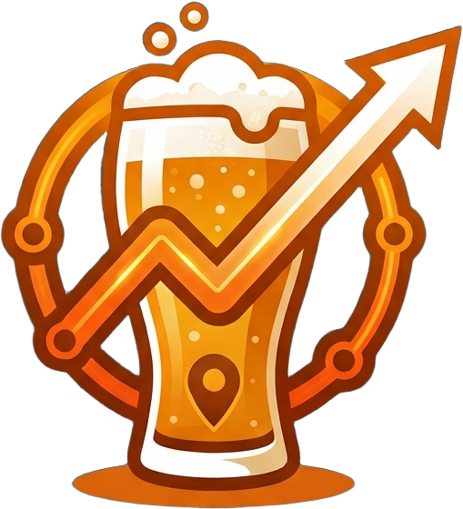
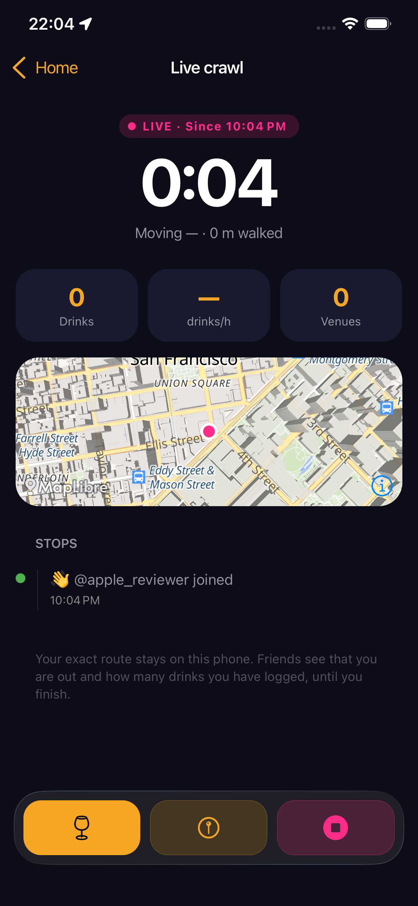
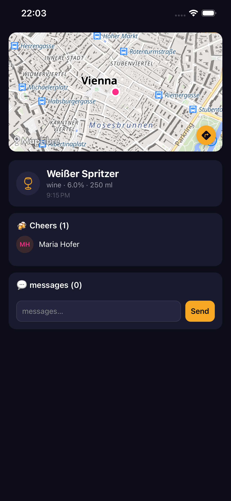
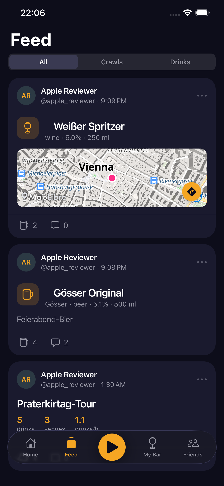

  

<h1 align="center">CheersOida</h1>

  <strong>Track the night. Cheer the friends along the way.</strong>

  
  

> 🐛 **Found a bug?** Open an issue on this repo — it also tracks CheersOida app bugs and feature requests, and every report gets read.

**Get the app:** CheersOida is in closed preview — email **[cheers@cheersoida.app](mailto:cheers@cheersoida.app)** to be added to TestFlight or Google Play internal testing.

## What is CheersOida?

CheersOida fuses social drink check-ins with Strava-style bar-crawl tracking. Log a drink, friends see it and send a **Cheers**. Press **Start** before a night out and the app records the route you walk between bars, detects when you arrive, and gives you a summary afterwards — distance, duration, venues visited, and **drinks per hour**.

## Features

- **GPS route** — every bar crawl becomes a replayable polyline.
- **Dwell detection** — sitting at the bar is the signal; walking past is not.
- **Friends & Cheers** — your mates see what you're drinking in real time and send a one-tap Cheers.
- **Bilingual DE / EN** — owned and operated from Austria.

## Screenshots

  
  &nbsp;&nbsp;
  
  &nbsp;&nbsp;
  

## Support

- **Account, previews, anything user-facing:** [cheers@cheersoida.app](mailto:cheers@cheersoida.app)
- **Full developer documentation:** [github.com/checkelmann/CheersOida](https://github.com/checkelmann/CheersOida)

---

## Deutsch

  <strong>Verfolg die Nacht. Feier die Freunde auf dem Weg.</strong>

  

> 🐛 **Bug gefunden?** Eröffne ein Issue in diesem Repo — CheersOida-App-Bugs und Feature-Wünsche werden ebenfalls hier getrackt, jedes Report wird gelesen.

**App holen:** CheersOida ist im Closed Preview — schreib eine E-Mail an **[cheers@cheersoida.app](mailto:cheers@cheersoida.app)**, um zu TestFlight oder Google Play Internal Testing eingeladen zu werden.

## Was ist CheersOida?

CheersOida verbindet soziale Drink-Check-ins mit Bar-Crawl-Tracking im Strava-Stil. Loggst du einen Drink, sehen es deine Freunde und schicken einen **Cheers**. Drück **Start** vor einer Nacht und die App zeichnet die Route zwischen den Bars auf, erkennt die Ankunft in jeder Bar und liefert danach eine Zusammenfassung — Distanz, Dauer, besuchte Bars und **Drinks pro Stunde**.

## Funktionen

- **GPS-Route** — jeder Bar Crawl wird zu einer abspielbaren Polylinie.
- **Dwell-Erkennung** — das Sitzen in der Bar ist das Signal; das Vorbeilaufen zählt nicht.
- **Friends & Cheers** — deine Freunde sehen live, was du trinkst, und schicken einen Cheers mit einem Tap.
- **Bilingual DE / EN** — aus Österreich, für Österreich und den DACH-Raum.

## Support

- **Account, Previews, alles User-seitige:** [cheers@cheersoida.app](mailto:cheers@cheersoida.app)
- **Vollständige Entwicklerdokumentation:** [github.com/checkelmann/CheersOida](https://github.com/checkelmann/CheersOida)

---

[Privacy policy](https://checkelmann.github.io/cheersoida-website/privacy.html) · [CheersOida app repo](https://github.com/checkelmann/CheersOida) · [cheersoida-website repo](https://github.com/checkelmann/cheersoida-website) · © 2026
